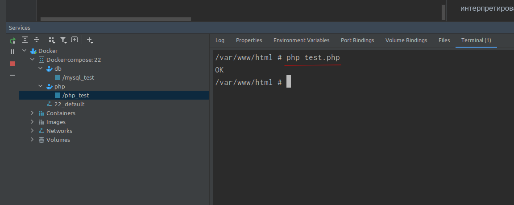

# Тестовое задание

Написать функцию формирования sql-запросов (MySQL) из шаблона и значений параметров.

Места вставки значений в шаблон помечаются вопросительным знаком, после которого может следовать спецификатор преобразования.

Спецификаторы:\
?d - конвертация в целое число\
?f - конвертация в число с плавающей точкой\
?a - массив значений\
?# - идентификатор или массив идентификаторов

Если спецификатор не указан, то используется тип переданного значения, но допускаются только типы string, int, float, bool (приводится к 0 или 1) и null.
Параметры ?, ?d, ?f могут принимать значения null (в этом случае в шаблон вставляется NULL).
Строки и идентификаторы автоматически экранируются.

Массив (параметр ?a) преобразуется либо в список значений через запятую (список), либо в пары идентификатор и значение через запятую (ассоциативный массив).
Каждое значение из массива форматируется в зависимости от его типа (идентично универсальному параметру без спецификатора).

Также необходимо реализовать условные блоки, помечаемые фигурными скобками.
Если внутри условного блока есть хотя бы один параметр со специальным значением, то блок не попадает в сформированный запрос.
Специальное значение должно возвращаться методом skip. Нужно выбрать подходящее значение на своё усмотрение.
Условные блоки не могут быть вложенными.

При ошибках в шаблонах или значениях выбрасывать исключения.

Для упрощения задачи предполагается, что в передаваемом шаблоне не будут использоваться комментарии sql.

В файле Database.php находится заготовка класса с заглушками в виде исключений. Нужно реализовать методы buildQuery и skip.
В файле DatabaseTest.php находятся примеры (тесты). Тесты обязательно должны быть успешными (в противном случае код рассматриваться не будет).

Код должен работать с php 8.3.

Оригинал тестового задания вы можете скачать здесь [test.zip](test.zip)

## Выполнение

Для удобства тестирования и выполнения задачи, я все завернул в докер. Где использовал php 8.3.8 и mysql 8.0.
Зпустим сам докер композ из каталога в котором находимся
```bash
docker compose up -d
```
Теперь сам же скрипт можно запустить внутри контейнера, например воспользовавшись терминалом phpstorm 



```bash
php test.php
```
ну или в обычном терминале компьютера
```bash
docker exec -ti php_test php test.php
```

## Пока решал задание возникли некоторые вопросы

1. Написано что строки и идентификаторы экранируются, Так же, что в спецификаторе ?# должны быть идентификаторы, но мы видим когда спецификатор у нас встретился между SELECT и FROM, он не экранирован. И тут возникает следующий вопрос.

2. Должно ли учитываться расположение спецификаторов в запросе? Если да, почему ничего не сказано об этом в задании? Если нет, то не понятно почему спецификаторы ведут себя по разному, где то экранируется, а где то нет.

3. Есть спорный момент в коде. В месте где тестируется код, есть две строчки в файле DatabaseTest.php:

```php
'SELECT * FROM users WHERE name = \'Jack\' AND block = 0'
```
и
```php
'UPDATE users SET `name` = \'Jack\', `email` = NULL WHERE user_id = -1'
```
что же здесь необычного? Посмотрим в документацию php:
> Обратный слеш в одинарных и двойных PHP-строках работает как служебный символ. Поэтому когда нужно сопоставить символ \ с регулярным выражением \\, в PHP-коде указывают "\\\\" или '\\\\'.

<https://www.php.net/manual/ru/regexp.reference.escape.php>

Т.е. в одинарных кавычках, экранирование должно быть так:
```php
'SELECT * FROM users WHERE name = \\\'Jack\\\' AND block = 0'
```
ну или данные строки должны быть в двойных кавычках. А иначе данная строка будет интерпретироваться без экранирования кавычек.

